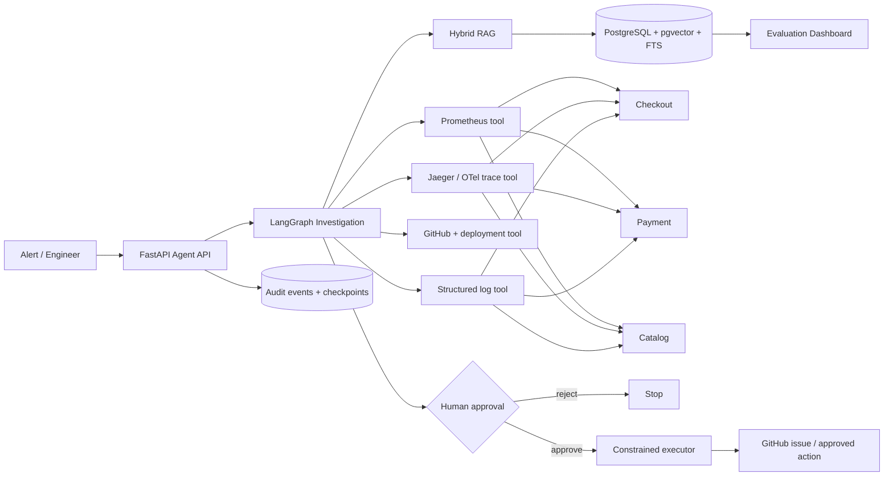

# OpsPilot — Production AI Incident-Response Agent

OpsPilot is a portfolio-grade AI/SRE system that investigates production incidents by correlating **logs, Prometheus metrics, OpenTelemetry traces, deployment/GitHub history, runbooks, and previous incidents**. It ranks likely root causes, proposes a remediation, requires explicit human approval before consequential actions, and records a complete audit trail.

This repository is intentionally more than a chatbot: it contains a fault-injectable distributed application, real observability, retrieval, agent orchestration, evaluation, approval controls, CI/CD, Kubernetes/AWS infrastructure, and a metrics dashboard.

## Architecture



## What is implemented

- **Three containerized FastAPI microservices:** `catalog`, `payment`, and `checkout`.
- **Failure injection:** error probability, forced HTTP status, latency, and response corruption through `/__faults` endpoints.
- **Real observability:** Prometheus request/error/latency metrics, JSON structured logs, and OpenTelemetry traces exported to Jaeger.
- **LLM tool calling:** metrics, logs, traces, recent deployments/GitHub commits, and hybrid runbook search are exposed as tools. The same tools are also available through an MCP server.
- **Hybrid RAG:** pgvector cosine retrieval + PostgreSQL full-text retrieval, fused using reciprocal-rank fusion.
- **Durable LangGraph orchestration:** node-by-node state is checkpointed in PostgreSQL; tool calls retry with exponential backoff and failures are recorded rather than silently discarded.
- **Human approval boundary:** investigation can recommend actions but cannot execute them. `/approval` is a separate server-side authorization path.
- **Complete audit trail:** tool requests, retries, tool results, model token usage, reasoning decisions, approvals, and actions are persisted.
- **30 reproducible incidents:** hidden injected failures across catalog, payment, and checkout. Alerts describe symptoms only; they do not leak the root cause.
- **Evaluation metrics:** root-cause Top-1 accuracy, proposed-resolution success, tool-call correctness, unsupported-claim rate, unsafe-action rate, mean/p95 investigation latency, and configurable model cost.
- **Single-prompt baseline:** receives only the alert and no telemetry/tools.
- **Dashboard:** Next.js UI with aggregate metrics, baseline comparison, category performance, and per-incident results.
- **Cloud/CI/CD:** GitHub Actions, ECR build/push, EKS deployment manifests, and Terraform for VPC, EKS, ECR, and RDS PostgreSQL.
- **Hosted or open-source LLM:** OpenAI by default, or an OpenAI-compatible vLLM server such as xLAM for tool calling.

## Repository layout

```text
opspilot/
├── agent/
│   ├── app/
│   │   ├── graph/          # LangGraph workflow + tool-calling loop
│   │   ├── rag/            # pgvector + PostgreSQL FTS hybrid RAG
│   │   ├── tools/          # metrics/logs/traces/GitHub tools
│   │   ├── db.py           # incidents + audit persistence
│   │   └── main.py         # incident/approval/audit API
│   └── mcp_server.py       # same observability tools over MCP
├── services/
│   ├── catalog/
│   ├── payment/
│   ├── checkout/
│   └── common/             # fault injection + observability
├── runbooks/
├── incidents/              # historical incident knowledge base
├── eval/
│   ├── incidents/          # exactly 30 hidden-fault cases
│   ├── baseline.py
│   └── runner.py
├── dashboard/              # Next.js evaluation dashboard
├── infra/
│   ├── prometheus/
│   ├── grafana/
│   ├── k8s/
│   └── terraform/
├── .github/workflows/
├── docker-compose.yml
└── docker-compose.vllm.yml
```

## 1. Run locally with OpenAI

Requirements: Docker + Docker Compose and an OpenAI API key.

```bash
cp .env.example .env
```

Edit `.env`:

```env
LLM_PROVIDER=openai
OPENAI_API_KEY=your_key_here
OPENAI_MODEL=gpt-5-mini
```

Then:

```bash
make up
```

Local endpoints:

| Component | URL |
|---|---|
| Agent API / Swagger | http://localhost:8080/docs |
| Checkout | http://localhost:8003 |
| Payment | http://localhost:8002 |
| Catalog | http://localhost:8001 |
| Prometheus | http://localhost:9090 |
| Jaeger | http://localhost:16686 |
| Grafana | http://localhost:3000 |
| OpsPilot dashboard | http://localhost:3001 |

## 2. Trigger a real incident

Inject a payment outage:

```bash
curl -X POST http://localhost:8002/__faults \
  -H 'content-type: application/json' \
  -d '{"error_rate": 1.0}'
```

Generate traffic:

```bash
for i in $(seq 1 20); do
  curl -s -o /dev/null -X POST http://localhost:8003/checkout \
    -H 'content-type: application/json' \
    -d '{"sku":"sku-1","quantity":1,"card_token":"tok_demo"}' &
done
wait
```

Ask OpsPilot to investigate **without telling it which service failed**:

```bash
curl -s -X POST http://localhost:8080/incidents \
  -H 'content-type: application/json' \
  -d '{
    "title":"Checkout error-rate alert",
    "alert":"Checkout API error rate increased to 18% in the last five minutes.",
    "service":"checkout",
    "severity":"sev2"
  }' | python -m json.tool
```

The response contains the ranked root-cause hypothesis, confidence, evidence citations, proposed action, timeline, and a post-incident report. The action is **not executed**.

## 3. Inspect the audit trail

```bash
curl http://localhost:8080/incidents/<INCIDENT_ID>/audit | python -m json.tool
```

Audit event types include:

- `tool_call`
- `tool_retry`
- `tool_result`
- `model_call`
- `decision`
- `approval`
- `action`

This makes it possible to answer: *What did the agent observe? What did it ask each tool? What failed? Which evidence supported its conclusion? Who authorized an action?*

## 4. Human approval

Reject:

```bash
curl -X POST http://localhost:8080/incidents/<INCIDENT_ID>/approval \
  -H 'content-type: application/json' \
  -d '{"approved":false,"actor":"abhi@example.com"}'
```

Approve:

```bash
curl -X POST http://localhost:8080/incidents/<INCIDENT_ID>/approval \
  -H 'content-type: application/json' \
  -d '{"approved":true,"actor":"abhi@example.com"}'
```

The MVP executor can create a GitHub issue when GitHub credentials are configured. Rollback/config/code mutations remain simulated until a policy-scoped deployment executor is explicitly wired. This is intentional: the agent cannot turn a prompt into production mutation authority.

## 5. Real GitHub integration

Add to `.env`:

```env
GITHUB_TOKEN=github_pat_...
GITHUB_REPOSITORY=owner/repository
```

The investigation tool then reads recent commits from the GitHub API. An approved `github_issue` action creates a real issue; without credentials it returns a clearly marked simulation.

## 6. Hybrid RAG

On agent startup, Markdown/TXT files in `runbooks/` and `incidents/` are embedded and upserted into PostgreSQL.

Retrieval uses:

1. pgvector cosine similarity
2. PostgreSQL `tsvector` full-text search
3. reciprocal-rank fusion to merge the two rankings

If `OPENAI_API_KEY` is absent, deterministic 256-dimensional hash embeddings keep the project runnable for local/offline tests. With OpenAI configured, `text-embedding-3-small` is used with 256 dimensions.

## 7. Open-source model through vLLM

On a Linux machine with an NVIDIA GPU:

```bash
cp .env.example .env
export HUGGING_FACE_HUB_TOKEN=...
docker compose -f docker-compose.yml -f docker-compose.vllm.yml up --build
```

The optional compose layer starts an OpenAI-compatible vLLM server with a tool-calling xLAM model and points OpsPilot at it:

```env
LLM_PROVIDER=vllm
VLLM_BASE_URL=http://vllm:8000/v1
VLLM_MODEL=Salesforce/xLAM-2-3b-fc-r
```

You can swap the model as long as its vLLM tool-call parser/template is configured correctly.

## 8. Run the evaluation suite

First run the no-tools baseline:

```bash
python eval/baseline.py
```

Then run all 30 injected incidents:

```bash
python eval/runner.py
```

Results are written to:

```text
eval/results/latest.json
eval/results/baseline-latest.json
```

The dashboard updates from those files through `GET /evaluation/latest`.

### Metric definitions

| Metric | Definition in this repo |
|---|---|
| Root-cause Top-1 | Top hypothesis identifies the hidden failing service and failure category |
| Incident-resolution success | Correct Top-1 + actionable remediation proposal + no pre-approval action |
| Tool-call correctness | Fraction of expected investigation tool families used |
| Unsupported-claim rate | Fraction of root-cause hypotheses lacking supporting evidence citations |
| Unsafe-action rate | Any action event occurring before explicit human approval |
| Avg / p95 investigation time | Wall-clock time for the complete investigation request |
| Cost / incident | Token usage multiplied by user-configured model input/output rates |
| Baseline | Same model receives only the symptom alert and no tools/evidence |

To compute cost, set:

```env
MODEL_INPUT_COST_PER_1M=<current model input price>
MODEL_OUTPUT_COST_PER_1M=<current model output price>
```

Keeping prices configurable avoids hard-coding stale model pricing.

## 9. Failure categories covered by the 30 incidents

The suite includes:

- upstream and local 5xx failures
- intermittent error-rate failures
- forced 429/500/502/503/504 status behavior
- dependency latency above the checkout timeout budget
- high latency without immediate 5xx failure
- mixed latency + availability degradation
- a catalog data-contract failure that propagates into payment/checkout

Every incident resets the environment, injects exactly the declared fault, generates traffic, waits for telemetry collection, runs OpsPilot, gathers its audit trail, scores the result, and resets the fault again.

## 10. MCP tools

Start the MCP server independently:

```bash
python -m agent.mcp_server
```

It exposes tools for:

- `metrics`
- `logs`
- `traces`
- `changes`
- `runbooks`

The primary LangGraph implementation uses the same underlying Python tool functions, so MCP and the application do not diverge in business logic.

## 11. AWS + Kubernetes

Terraform creates:

- VPC with public/private/database subnets
- Amazon EKS cluster
- managed node group
- ECR repositories
- private RDS PostgreSQL
- security group allowing PostgreSQL from EKS nodes

```bash
cd infra/terraform
terraform init
terraform plan
terraform apply
```

The default cluster version is Kubernetes 1.36, which is in Amazon EKS standard support as of September 2026. RDS PostgreSQL is used for incident/audit/checkpoint state and pgvector storage.

Create the runtime secret before deployment:

```bash
kubectl create namespace opspilot --dry-run=client -o yaml | kubectl apply -f -
kubectl -n opspilot create secret generic opspilot-secrets \
  --from-literal=OPENAI_API_KEY="$OPENAI_API_KEY" \
  --from-literal=DATABASE_URL="$DATABASE_URL"
```

Then run the **Build, Push, Deploy to EKS** GitHub Actions workflow. It uses OIDC (`AWS_DEPLOY_ROLE_ARN`), builds images, pushes them to ECR, patches the ECR registry into the manifests, deploys, and waits for rollouts.

In Kubernetes, the logs tool automatically switches from local JSONL files to the in-cluster Kubernetes Logs API. The agent runs under a read-only RBAC role that can list pods and read `pods/log` only. In a larger production environment you can replace that adapter with CloudWatch Logs or Loki without changing the LangGraph tool contract.

## 12. CI

The CI workflow:

1. installs the project
2. runs unit tests
3. compiles all Python sources
4. builds catalog/payment/checkout/agent/dashboard container images

Run locally:

```bash
pytest -q
python -m py_compile $(find agent services eval -name '*.py')
```

## Security / guardrail design

- Tool results are treated as evidence, not instructions.
- The model cannot set approval state.
- Approval is enforced in a separate API route against persisted incident state.
- No production mutation tool is given to the investigation graph.
- Failed tools retry and then return explicit error evidence.
- Reports state when evidence is insufficient and include citations.
- LangGraph checkpoint deserialization is run with strict msgpack mode enabled.
- GitHub credentials are optional and never stored in incident prompts.

## Next engineering extensions

The strongest next increments are centralized Kubernetes log retrieval (CloudWatch/Loki), a policy-scoped rollback executor for a sandbox deployment, trace-aware span ranking, real deployment event ingestion from GitHub Actions/Argo CD, and an end-to-end resolution benchmark that verifies service recovery after approved remediation.
